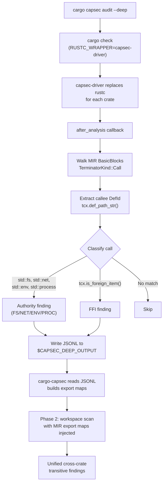

# capsec-deep

MIR-based deep analysis driver for capsec. Uses `rustc`'s Mid-level IR to detect ambient authority usage that syntactic analysis misses — macro-expanded FFI calls, trait dispatch, and generic instantiation.

## Requirements

- Nightly Rust toolchain (pinned in `rust-toolchain.toml`)
- `rustc-dev` and `llvm-tools` components

## Install

```bash
cd crates/capsec-deep
cargo install --path .
```

This installs the `capsec-driver` binary, which `cargo capsec audit --deep` invokes automatically.

## How it works

`capsec-driver` is a custom Rust compiler driver. When invoked via `RUSTC_WRAPPER`, it intercepts every crate compilation, runs the normal compiler pipeline through type checking, then walks the MIR of every function looking for:

- **Authority calls** — `std::fs::*`, `std::net::*`, `std::env::*`, `std::process::*` resolved through the full type system (including macro expansion)
- **FFI calls** — any call to a `DefKind::ForeignFn` item (catches `-sys` crate wrappers like `libgit2-sys`, `sqlite3-sys`)

Findings are written as JSONL to a temp file, which the main `cargo-capsec` CLI reads, merges with syntactic findings, and feeds into the cross-crate export map system for transitive propagation.

## Architecture



## Standalone testing

```bash
# Test on a single file
CAPSEC_DEEP_DEBUG=1 cargo run -- --edition 2024 tests/fixtures/simple_fs.rs

# Test FFI detection through macros
CAPSEC_DEEP_DEBUG=1 cargo run -- --edition 2024 tests/fixtures/macro_ffi.rs
```

## Excluded from workspace

This crate requires nightly and is listed in the workspace `exclude` list. It builds independently and does not affect `cargo test --workspace` or `cargo check --workspace` on stable.
